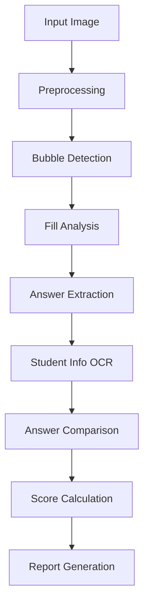
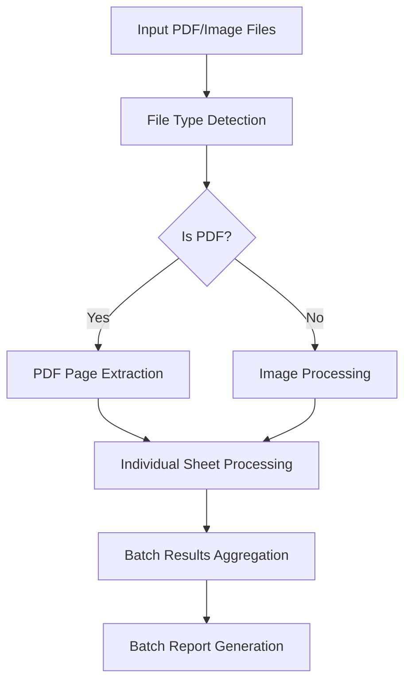

# OMR System Design for Checking MCQ Papers

## 1. System Overview

This document outlines the design for an automated OMR (Optical Mark Recognition) system to check MCQ (Multiple Choice Question) answer sheets. The system is designed to process scanned answer sheets, extract marked answers, compare them against answer keys, and generate detailed reports.

## 2. System Requirements

### 2.1 Input Requirements
- **Answer Sheet Format**: Standard MCQ answer sheet with:
  - 30 questions per sheet
  - 4 options per question (A, B, C, D)
  - Student information fields (Name, P.No, Date)
- **File Formats**: 
  - Individual images (JPG, PNG)
  - Multi-page PDF documents containing multiple answer sheets
- **Answer Key**: JSON format with question numbers and correct answers

### 2.2 Functional Requirements
1. Image preprocessing and enhancement
2. Bubble detection and analysis
3. Student information extraction (OCR)
4. Answer key management
5. Answer comparison and scoring
6. Batch processing of multiple sheets
7. Detailed result reporting (PDF, CSV)
8. Web-based user interface

## 3. System Architecture

The system follows a modular architecture with the following components:

```
┌─────────────────────────────────────────────────────────────┐
│                    Frontend (React)                         │
├─────────────────────────────────────────────────────────────┤
│                    Backend (FastAPI)                        │
├─────────────────────────────────────────────────────────────┤
│  Image Processing  │  PDF Processing  │  OCR Processing     │
├─────────────────────────────────────────────────────────────┤
│                 Data Storage & Management                   │
└─────────────────────────────────────────────────────────────┘
```

### 3.1 Core Components

#### 3.1.1 Image Preprocessing Module
- **Purpose**: Enhance image quality for better bubble detection
- **Techniques**:
  - Grayscale conversion
  - Contrast enhancement (CLAHE)
  - Gaussian blur for noise reduction
  - Adaptive thresholding for binary conversion

#### 3.1.2 Bubble Detection Module
- **Purpose**: Identify and analyze answer bubbles
- **Techniques**:
  - Contour detection
  - Circular shape filtering
  - Fill percentage calculation
  - Position-based grouping

#### 3.1.3 OCR Module
- **Purpose**: Extract student information
- **Techniques**:
  - Tesseract OCR engine
  - Region-of-interest cropping
  - Text post-processing

#### 3.1.4 PDF Processing Module
- **Purpose**: Handle multi-page PDF documents
- **Techniques**:
  - Page extraction
  - Image conversion
  - Batch processing coordination

#### 3.1.5 Answer Comparison Module
- **Purpose**: Compare student answers with answer keys
- **Features**:
  - Score calculation
  - Detailed question-wise analysis
  - Grade assignment

#### 3.1.6 Reporting Module
- **Purpose**: Generate comprehensive reports
- **Formats**:
  - PDF (detailed individual and batch reports)
  - CSV (summary data for analysis)

## 4. Detailed Workflow

### 4.1 Single Sheet Processing Workflow



### 4.2 Batch Processing Workflow



## 5. Technical Implementation

### 5.1 Image Processing Pipeline

1. **Preprocessing Steps**:
   ```python
   # Convert to grayscale
   gray = cv2.cvtColor(image, cv2.COLOR_BGR2GRAY)
   
   # Apply CLAHE for contrast enhancement
   clahe = cv2.createCLAHE(clipLimit=2.0, tileGridSize=(8,8))
   enhanced = clahe.apply(gray)
   
   # Apply Gaussian blur
   blurred = cv2.GaussianBlur(enhanced, (3, 3), 0)
   
   # Adaptive thresholding
   thresh = cv2.adaptiveThreshold(
       blurred, 255, cv2.ADAPTIVE_THRESH_GAUSSIAN_C, 
       cv2.THRESH_BINARY_INV, 11, 2
   )
   ```

2. **Bubble Detection**:
   ```python
   # Find contours
   contours, _ = cv2.findContours(thresh, cv2.RETR_EXTERNAL, cv2.CHAIN_APPROX_SIMPLE)
   
   # Filter by area and circularity
   bubbles = []
   for contour in contours:
       area = cv2.contourArea(contour)
       if 10 < area < 500:  # Size filtering
           x, y, w, h = cv2.boundingRect(contour)
           aspect_ratio = w / float(h)
           if 0.7 <= aspect_ratio <= 1.3:  # Circularity check
               bubbles.append({
                   'contour': contour,
                   'x': x, 'y': y, 'w': w, 'h': h,
                   'center': (x + w//2, y + h//2)
               })
   ```

3. **Fill Analysis**:
   ```python
   # Calculate fill percentage for each bubble
   for bubble in bubbles:
       x, y, w, h = bubble['x'], bubble['y'], bubble['w'], bubble['h']
       bubble_region = thresh[y:y+h, x:x+w]
       total_pixels = bubble_region.size
       filled_pixels = np.sum(bubble_region == 255)
       fill_percentage = filled_pixels / total_pixels if total_pixels > 0 else 0
   ```

### 5.2 PDF Processing

The system uses PyMuPDF (fitz) for efficient PDF processing:

```python
import fitz  # PyMuPDF

def extract_pages_from_pdf(pdf_path, output_dir, dpi=300):
    pdf_document = fitz.open(pdf_path)
    extracted_images = []
    
    for page_num in range(pdf_document.page_count):
        page = pdf_document[page_num]
        # Render page to image
        zoom = dpi / 72
        mat = fitz.Matrix(zoom, zoom)
        pix = page.get_pixmap(matrix=mat, alpha=False)
        
        # Save image
        output_path = f"{output_dir}/page_{page_num + 1:03d}.jpg"
        pix.save(output_path)
        extracted_images.append(output_path)
    
    pdf_document.close()
    return extracted_images
```

### 5.3 OCR Processing

Using Tesseract OCR for student information extraction:

```python
import pytesseract
from PIL import Image

def extract_student_info(image_path, roi_coords):
    image = Image.open(image_path)
    # Crop to region of interest
    cropped = image.crop(roi_coords)
    # Extract text
    text = pytesseract.image_to_string(cropped)
    return text.strip()
```

## 6. Data Models

### 6.1 Answer Key Model
```json
{
  "1": "A",
  "2": "B",
  "3": "C",
  "..."
}
```

### 6.2 Processing Result Model
```json
{
  "score": 25,
  "total": 30,
  "percentage": 83.33,
  "marked_answers": {
    "1": "A",
    "2": "B",
    "..."
  },
  "correct_answers": {
    "1": "A",
    "2": "B",
    "..."
  },
  "result": {
    "1": "correct",
    "2": "incorrect",
    "..."
  },
  "student_info": {
    "name": "John Doe",
    "roll_number": "123456",
    "date": "2023-10-15"
  }
}
```

## 7. User Interface Design

### 7.1 Main Dashboard
- File upload section (images/PDF)
- Answer key management
- Processing controls
- Results display

### 7.2 Processing Workflow
1. **Step 1: Setup Answer Key**
   - Upload reference sheet or select existing key
   - Manual entry option

2. **Step 2: Upload Student Sheets**
   - Individual image upload
   - PDF batch upload

3. **Step 3: Process & View Results**
   - Start processing button
   - Progress indicator
   - Results table

4. **Step 4: Download Reports**
   - PDF report generation
   - CSV export

## 8. System Enhancements

### 8.1 AI Integration
- **GPT-4 Vision** for enhanced bubble detection
- **Google Gemini** for improved OCR accuracy
- **Hybrid approach** combining AI and traditional CV

### 8.2 Advanced Features
- **Multiple marking detection** and handling
- **Partial fill detection** with sensitivity adjustment
- **Sheet alignment correction** for skewed scans
- **Template support** for different answer sheet layouts

### 8.3 Performance Optimization
- **Parallel processing** for batch operations
- **Caching mechanisms** for repeated operations
- **Memory optimization** for large PDF files

## 9. Deployment Architecture

### 9.1 Development Environment
- **Backend**: FastAPI with Python 3.8+
- **Frontend**: React with Vite
- **Database**: SQLite (can be upgraded to PostgreSQL)
- **Image Processing**: OpenCV, Pillow
- **OCR**: Tesseract
- **PDF Processing**: PyMuPDF

### 9.2 Production Deployment
- **Containerization**: Docker for consistent deployment
- **Orchestration**: Docker Compose for multi-service deployment
- **Scaling**: Horizontal scaling for batch processing
- **Monitoring**: Logging and performance metrics

## 10. Security Considerations

- **File validation** to prevent malicious uploads
- **Rate limiting** to prevent abuse
- **Data encryption** for sensitive information
- **Access control** for administrative functions

## 11. Future Enhancements

1. **Mobile Application**: Native mobile app for on-the-go processing
2. **Cloud Integration**: AWS/GCP integration for scalable processing
3. **Machine Learning**: Train custom models for better accuracy
4. **Real-time Processing**: WebSocket integration for live updates
5. **Multi-language Support**: Support for different languages in OCR

## 12. Troubleshooting Guide

### 12.1 Common Issues
- **Poor image quality**: Ensure good lighting and high resolution
- **Incorrect bubble detection**: Adjust threshold parameters
- **OCR failures**: Improve contrast and clarity of text regions
- **PDF processing errors**: Install required dependencies (PyMuPDF)

### 12.2 Debugging Tools
- Visual debugging of preprocessed images
- Bubble detection overlay visualization
- Detailed logging for each processing step
- Performance metrics and timing information

This system design provides a comprehensive framework for building a robust OMR checking system that can handle various input formats and provide accurate results with detailed reporting capabilities.